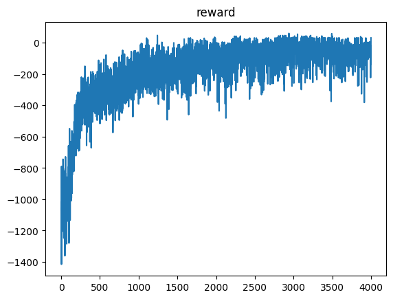

# 电动公交调度

要利用了 PPO 实现了电动公交系统的调度，`cc_ppo.py` 主要包含了 PPO 的搭建以及多智能体 PPO 的简易实现， `cc_env.py` 主要包括了简易实验环境的搭建， `main.ipynb` 为主文件. `Data` 存放了峰谷电价等数据，详情可见 [电动公交调度(PPO)](https://www.cnblogs.com/CaiShee/p/18262582)

